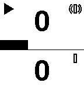
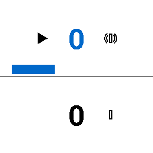

# One More Minute

A count-up timer for the classic Pebble watch. Two timers, one vibe assignment: a timer you can wear on your wrist while cooking or focus-sprinting, and that hums a Roman numeral at every completed minute.

## What it does

- Two count-up timers displayed in stacked zones.
- Each zone shows: the elapsed **minutes** (large center number), a **seconds progress bar** (fills left-to-right over 60 s), a **play/pause indicator** (top-left, filled triangle when running, two bars when paused, blank when the timer is at zero), and a **vibration icon** (top-right) — an outlined circle with two concentric arcs on each side when that timer has the vibe assignment, or just the outlined circle alone when it does not.
- At most one timer at a time can vibrate. When enabled, it emits a **Roman-numeral vibration pattern** at each completed minute (1 → I, 4 → IV, 5 → V, 9 → IX, 10 → X, …). Pulses are short (125 ms), medium (250 ms), or long (500 ms). Gaps between symbols are perceptually tuned: **100 ms** between identical symbols in the same group (e.g., I→I, X→X) and **350 ms** between different symbol groups (e.g., V→I, X→V) so the pattern stays readable rather than blurring together. See [Smartwatches with higher-bandwidth vibration notifications](https://www.harlan.harris.name/2016/05/smartwatches-with-higher-bandwidth-vibration-notifications/) for background on the design approach.
- Vibration assignment cycles through **timer 1 → timer 2 → none → timer 1 …**.

## Controls

| Button | Short press | Long press (700 ms) |
|--------|-------------|---------------------|
| UP     | Start / stop timer 1 | Clear timer 1 (reset to 0:00) |
| DOWN   | Start / stop timer 2 | Clear timer 2 (reset to 0:00) |
| SELECT | Cycle vibe assignment: timer 1 → timer 2 → none | — |
| BACK   | Exit app | — |

Timers freeze where they are when stopped. Short-pressing again resumes from the frozen position. Clearing zeroes the timer and stops it.

## Display

The app displays two timer zones stacked vertically, separated by a horizontal divider.

**Rectangular displays** (basalt, diorite, emery, flint):



**Round displays** (chalk, gabbro):



Content clusters near the center divider on round displays to avoid clipping at the circular edges. Icons and progress bars are inset from the screen edges.

**Color displays** (basalt, chalk, emery, gabbro):
Progress bars render in accent blue. The vibe-assigned timer's minute number also renders in accent blue. Black-and-white displays (diorite, flint) remain pure B/W.

**High-resolution displays** (emery, gabbro):
Icons remain at 24px (Pebble SDK bitmaps tile rather than scale, so larger icons would require separate 36x36 resources).

Indicator legend:

- **Upper-left**: filled triangle when running, two bars when paused, blank when the timer is at 0:00.
- **Upper-right**: outlined circle with two concentric arcs on each side when that timer holds the vibe assignment; bare outlined circle when it does not.
- **Bottom**: horizontal progress bar (16 px tall), fills left-to-right over 60 seconds, resets at each minute boundary.

## Vibration patterns

Roman numerals of the minute number, mapped to Pebble vibe durations:

| Symbol | Vibe   | Duration |
|--------|--------|----------|
| I      | short  | 125 ms   |
| V      | medium | 250 ms   |
| X      | long   | 500 ms   |
| IV     | short, medium | |
| IX     | short, long  | |

Gaps between symbols are grouped by perceptual salience:

- **100 ms** short gap between identical symbols in the same group (e.g., the three I's in III, or the X's in XX)
- **350 ms** long gap between different symbol groups (e.g., V then I in VIII, or X then I in XIV)

Example: minute 8 (VIII) = medium, *(long gap)*, short, *(short gap)*, short, *(short gap)*, short.

Minute 0 is silent. First vibration fires at 1:00. Patterns go up to **39** minutes (XXXIX); beyond that, use a different timer.

## Requirements

- Pebble Time / Time Steel (basalt), Pebble Time Round (chalk), Pebble 2 (diorite), Pebble Time 2 (emery), Pebble 2 Duo (flint), or Pebble Round 2 (gabbro)
- **Pebble OS 4.x**
- Pebble app paired to your watch
- [`pebble` CLI](https://developer.rebble.io/developer.pebble.com/sdk/install/) (for sideloading)

## Sideloading to a physical watch

1. Build the app:
   ```
   pebble build
   ```
   This creates `build/One-More-Minute.pbw`.

2. Make sure your phone is on the same Wi-Fi as your Mac, then find your phone's IP (settings → Wi-Fi → tap your network).

3. Install directly over the network:
   ```
   pebble install --phone <PHONE_IP>
   ```

4. Launch the app from the Pebble launcher on your watch.

## Sideloading to the Pebble emulator

```
pebble install --emulator flint
```

Then tap the app icon in the emulator's watch face.

## Building from source

```
cd One-More-Minute
pebble build
```

## Tests

```
npm run test:watch   # C unit tests (timer math + vibration patterns)
npm run test:js      # (reserved — no JS-side logic in this app)
```

`test:watch` compiles standalone test binaries with `cc -std=c99`; no Pebble SDK required for the logic tests.

## Project layout

```
src/c/              Watch-app C sources
src/pkjs/           PebbleKit JS (empty — pure on-watch app)
test/watch/         C unit tests
wscript             Pebble/Waf build config
package.json        App manifest (UUID, platforms, targets: basalt, chalk, diorite, emery, flint, gabbro)
build/              Build output (do not commit)
```

## Limitations

- Capped at 39 minutes (Roman numeral ceiling on this small vibe engine).
- Timers are **not persistent** — they reset to 0 when the app exits.

## To Do

- Phone config allows toggling between Roman numeral and simple per-minute taps
- Support count-ups past 39 minutes
- Scale up icons to 36x36 for high-res displays


